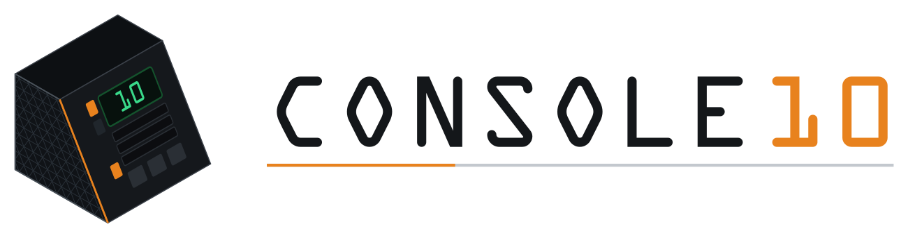

<p align="center">
  <picture>
    <source media="(prefers-color-scheme: dark)" srcset="branding/console10_logo_dark.png">
    
  </picture>
</p>

# Console10

Modular desktop **10" mini-rack housing system**, styled after NASA Mission Operations Control Room consoles. Each module is a self-contained 3D-printed enclosure that houses small-form-factor 10" mini-rack equipment (Pi mounts, small routers, Stream Decks, mini displays).

See `designdoc.md` (**v3.3**) for the full specification, including the accessory faceplates (§15–17).

## Architecture (v3.0)

A module is **4 printed parts**: 2 isogrid **cheeks** + a one-piece **top** + a one-piece **bottom**. The back is an open equipment plane. The **front slant insert is an accessory**, not a cabinet part — see "Cabinet vs. accessories" below. (Corrected 2026-08-01; previously read "5 printed parts".)

The v2.4–v2.5 split-half + centerline-dovetail panel scheme is **abandoned**. Top and bottom are now **single-piece** panels whose width aligns with the 10" mini-rack standard (~253 mm) — so each prints as **one part on a 255 mm bed**. Joinery is **rabbet-based** (no dovetail):

- **Bottom** → raised side ridges seat into **rabbets in the cheek bottom edges**.
- **Top** → a rabbet receives each **cheek's top edge**.
- Secured with glue or fasteners (TBD).

## Cabinet vs. accessories

**"Console10" = the cabinet only**: 2 cheeks + top + bottom. Everything
that mounts to it — display faceplates, the MacroPad panel, the screen/slider panel, blank
fillers, the Gridfinity drawer — is a **swappable accessory faceplate** that bolts to the
cheek **slant inserts** (front) or **back-edge inserts**. Panels are sized to the rack U
grid and the ~253 mm width. `Console10_module.scad` is the fit-check assembly that places
the cabinet + a chosen accessory on the slant.

### Accessory faceplates (current)

| File | Accessory | Mount | Status |
|------|-----------|-------|--------|
| `Console10_display_faceplate.scad` | 7" monitor faceplate (Elecrow RC070 / GeeekPi) | 3U slant | v0.17 |
| `Console10_lower_blank_faceplate.scad` | Blank filler beneath the display | 2U slant | v0.1 |
| `Console10_macropad_pair_faceplate.scad` | 2× MacroPad + 0.91" OLED + 6 switch guards | 3U slant | v0.5 |
| `Console10_screen_slider_panel.scad` | 4" HyperPixel sq + NeoSlider fader + OLED + 3 toggle guards | 3U | v0.1 |
| `Console10_dsky_panel.scad` | DSKY-style: HyperPixel + MacroPad + slider + OLED | 3U | v0.1 |
| `Console10_drawer.scad` | Gridfinity slide-out drawer | 2U | WIP v0.1 |
| `Console10_phone_2u_faceplate.scad` | Pixel 10 Pro XL dock: charger puck + eject lever (see `HANDOFF-phone-2u-faceplate.md`) | 2U slant @ s=133.35 | v0.2 |
| `Console10_b860i_faceplate.scad` | ASUS B860-I rear-I/O cover plate (truenas2) | 2U | v0.1 |

Plus assorted blanks / holders (`Console10_aux_2u_faceplate`, `..._bluray_2u_faceplate`,
`..._lcd_simple_faceplate`, `..._sd_holder_handled`, `..._bit_holder_handled`, etc.).

## Repository layout / file status

| File | Role | Status |
|------|------|--------|
| `designdoc.md` | Design spec | ✓ v3.3.1 |
| `README.md` | This file | ✓ synced to v3.3.1 (2026-07-28) |
| `Console10_isogrid.scad` | **Cheek** (parametric source) | ✓ v3.1 — rabbets on both top & bottom edges (old v2.4 tab-channels removed) |
| `Console10_isogrid_vent.scad` | Cheek variant: isogrid field cut THROUGH for airflow (drop-in `cheek()` swap; mirrors `Console10_isogrid.scad` — keep in sync) | ✓ v3.0-vent · export `stl/Console10_cheek_vent.stl` |
| `Console10_top.scad` | **Top** panel (parametric source) | ✓ v3.1 |
| `Console10_bottom.scad` | **Bottom** panel (parametric source) | ✓ v3.1 |
| `Console10_front_insert.scad` | **Front** insert (parametric source) | ✓ v3.1 |
| `stl/Console10_cheek.stl` · `stl/Console10_top.stl` · `stl/Console10_bottom.stl` · `stl/Console10_front_insert.stl` | **Current exports — print these** | ✓ 2026-05-28 |
| `NEW_NASA_TOP.stl` · `new_nasa_bottom.stl` · `NASA_Insert_Front.stl` | Reference STL models | superseded by the `.scad` parts |
| `Console10_isogrid-new.stl` | Older cheek export (2026-05-17) | superseded by `stl/Console10_cheek.stl` |
| `Console10_isogrid-do-not-delete.stl` | Old 6 mm cheek | superseded |
| `Console10_top_panel_half.scad` | Split-half top | ✗ DEPRECATED |
| `Console10_bottom_panel_half.scad` | Split-half bottom | ✗ DEPRECATED |
| `Console10_module.scad` | Full fit-check assembly (cabinet + accessory faceplates) | ✓ built |
| `preview/` | Rendered previews | — |
| `marketing/` | Promo materials: storyboard, shot board, video brief | — |
| `wip/` | Scratch: animation runs, logs, backups (untracked except `_parts.py`) | local only |

## Standards (locked)

- **10" mini-rack** (EIA-310-D): 1U = 44.45 mm; rail-to-rail = 236.525 mm; per-U holes at 6.35 / 22.225 / 38.10 mm
- **Equipment mounting**: 10-32 brass heat-set inserts in the cheek edge faces (24 per cheek)
- **Capacity**: 4U (C4)
- **Target bed**: 255 × 255 × 255 mm (all parts single-piece)

## Module dimensions (v3.0)

| Dimension | Value |
|-----------|-------|
| Cheek silhouette | Right trapezoid, slant on FRONT |
| Bottom / depth | **228.6 mm** |
| Back-edge height | **205.45 mm** |
| Top-edge length | **109.975 mm** |
| Front (slant) length | **237.25 mm** |
| Slant angle | **30° from vertical** (isogrid-aligned) |
| Cheek thickness | **10 mm** |
| Top/bottom panel width | **~253 mm** (10" mini-rack standard, single-piece bed-fit) |

## Parts list (4 printed parts + accessories)

**The cabinet — this is what "four printed parts" means:**

| Part | Count | Print orientation |
|------|-------|-------------------|
| Cheek (L + R mirror) | 2 | Flat, exterior face down, isogrid up |
| Top panel | 1 | Flat (support rabbet overhang as needed) |
| Bottom panel | 1 | Flat (support ridge overhang as needed) |

**Accessories — printable and legitimate, but never counted in the cabinet:**

| Part | Count | Print orientation |
|------|-------|-------------------|
| Front slant insert | 1 | Wedge oriented for minimal support |
| Slant cap | 1 | Glue-on filler; only meaningful with a display faceplate |
| Faceplates (display / macropad / blank / …) | n | See the accessory table above |

*Corrected 2026-08-01 — this heading read "(5 printed parts)" and the table listed the
front insert as a cabinet part. The authoritative lists are `CABINET_PARTS` and
`ACCESSORY_PARTS` in `Console10_module.scad`, which `wip\_parts.py` parses with no
fallback, so any render's part count now comes from the SCAD rather than from this table.*

## OpenSCAD usage

```
openscad Console10_isogrid.scad     # cheek (parametric)
openscad Console10_module.scad      # full fit-check assembly (built)

# headless export of the whole cabinet, no faceplates:
openscad -o module.stl -D show_front=true -D show_macropad=false \
         -D show_display=false -D show_lower_blank=false Console10_module.scad
```

**All four cabinet parts are parametric SCAD** as of v3.1 — `Console10_isogrid.scad`, `Console10_top.scad`, `Console10_bottom.scad`, `Console10_front_insert.scad`. `Console10_module.scad` `use<>`s all four and places them; that file is the authority on how the parts seat. Current exports are in `stl/`. The root-level `NEW_NASA_TOP.stl`, `new_nasa_bottom.stl` and `NASA_Insert_Front.stl` are the earlier hand-modelled generation, kept for reference only — they are not byte-identical to the current exports even where bounding boxes match, so don't print from them.

## Open items

See `designdoc.md` §13. Highlights: reconcile final width vs rabbet geometry; finalize glue vs fasteners; first-print validation of the 0.4 mm ridge/rabbet clearance; decide front-insert merge-into-bottom vs standalone + glue.

Closed since this list was written: the cheek tab-channels **were** replaced with rabbets (v3.1, both top and bottom edges), the front wedge **is** 30° and mates flush, and `Console10_module.scad` **is** built.

Closed 2026-08-01: `Console10_module.scad` used to draw `slant_cap_on_slant()` unconditionally; it is now gated behind `show_slant_cap` (default off — only meaningful with `show_display` on).

## Variants

- **C4** (4U, current) · C2 (2U, future) · C6 (6U, future) · C4-E (sci-fi etched, deferred)
